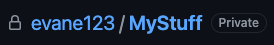
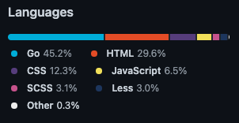

# Personal Portfolio Website

This website is a personal portfolio website to highlight my own skills, experience with programming to target potential employers, collaborators and partners. 

Included in this overview will be insights into my own personal journey as a developer. Sections on Work Experience, Project Experience and semi-formal descriptive text with complimenting images will be the primary content across this small site. 

There will be three pages; 
- home.html
- projects.html
- contact.hmtl

# Wireframes;
### Home (v1)

I decided it would be helpful to have a section below my work experience, highlighting any academic and professional achievements that I have attained.

### Home (v2)

### Projects

### Contact

## UX 
For UX Design, I'm going with a mimic of VsCode's [Dark Theme](https://code.visualstudio.com/docs/getstarted/themes).
For the last few years this has been my primary editor, and I've come to really like the color-scheme it uses.
I feel this scheme combined with a resumé/portfolio style website would be complimentary. 

- Main Background; 

- Interactive elements;

- Headings;

- Text/paragraphs;

## Features
- Responsive Navigation menu
- Show Text Over An Image On Click (Js) for Work Experience section of home page
- Button menu to control content shown by Language for Projects page
- Form Input section for Contact Page
- External Linking for Social Media and Contact img links (Font-awesome)
- Hover affect (hover.css) for images on Work Experience sections and Projects sections

### Existing Features

### Features Left to Implement

## Technologies Used
- [HTML]()
    - The project uses **HTML**.
- [CSS]()
    - The project uses **CSS**.
- [Javascript]()
    - The project uses **Javascript**.
- [Bootstrap]()
    - The project uses **Bootstap** to simplify the content structure and provide pre-built functionalities such as navigational templates and grid-classes.

## Testing
### Navigation
- Centering of navigation in [!img nav-not-centered]

### onClickTextOverImg
- I needed to use an external source (CodePen) to test this functionality and get it right; 
https://codepen.io/evane123/pen/vYgKmMM

Implementing it directly into the website proved very difficult. I found myself getting a bit confused with linking the class name between the script tag, html and css. 
Once I got testing it in codepen and with help from a udemy course (Creditted) I was able to get the desired functionality.

## Deployment
- Github pages
I've opted to use [Github Pages](https://pages.github.com/) 

The reason for this decision is due to ease of use. With my code already on Github, using Pages will save essential time avoiding the set up of multiple services and server space. 

In the future, I would like to host my website(s) myself. This would be experience, and to offer a more professional feel to the site. 

## Credits
- [Aaron Sinnott](https://ie.linkedin.com/in/aaronsinnott)
As my mentor for this project, Aaron was detrimental in reinforcing my key understandings of what is required, and more importantly how to properly approach and manage a project from an academic standpoint. 

- Udemy 
    - [Web Design](https://www.udemy.com/course/web-design-for-beginners-real-world-coding-in-html-css/)
    - [Javascript](https://www.udemy.com/course/the-complete-javascript-course/)

Through the last year I have been spending time going through some udemy courses that helped forming of idea's and speccing out what is possible. I used this to my advantage in the Work Experience Section, implementing a small script to handle showing of text that is hidden behind an image when you click on the image. 

### Content

As this is a personal portfolio website, the vast majority of the content is written personally by myself. An outline of the key pieces of information can be found here; 

home.html
- About Me Section
- Work Experience Section
    - Learn4Fun information
    - Teamwork information
    - Voxpro information
    - McDonalds information
    - Eddie Rockets information
- Achievements section 

projects.html
- My experience section (overall statement)
- Html/CSS
- Javascript
- Bootstrap 3
- Vue.js
- GoLang
- JAVA

In this Projects section, my intention initially was to try and embed working examples of these projects. After spending some time, I realized that my local environment is not suitable for this. 
In the future, I intend to clean up my environment so that each project can be hosted individually on Github, and referenced when needed. Below is a graphic of my current environmentlanguage breakdown;

### Media
### images folder
    - eddie_rockets_logo.png

### readme_imgs folder
- Github Private Repo screenshots acquired while logged into my github.com account. 

### Acknowledgements
- FETAC Level 5 information technology course
    - Html and CSS fundamentals
- Udemy;
    - [Web Design](https://www.udemy.com/course/web-design-for-beginners-real-world-coding-in-html-css/)
    - [Javascript](https://www.udemy.com/course/the-complete-javascript-course/)